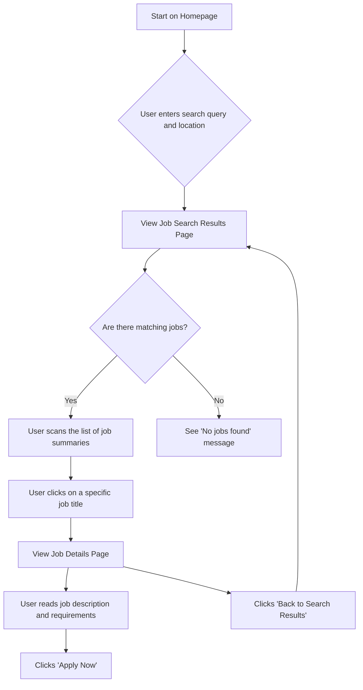

# User Flow: Viewing Job Listings

This document outlines the user flow for a job seeker searching for and viewing job listings on the portal.

## Flow Diagram

## Flow Steps

1. **Start**: The user begins on the homepage of the job portal.
2. **Search**: The user enters their desired job keywords (e.g., "Software Engineer") and a location into the search bar and initiates the search.
3. **View Results**: The user is taken to the search results page, where a list of jobs matching their criteria is displayed.
4. **Decision Point**:
   * **If jobs are found**, the user scans the list, which shows a summary of each job (Title, Company, Location).
   * **If no jobs are found**, a message is displayed informing the user.
5. **View Details**: The user clicks on a job title from the list to navigate to the job details page.
6. **Review Details**: On the job details page, the user can read the full job description, requirements, and other relevant information.
7. **Next Action**: From the details page, the user can either:
   * Proceed to apply for the job.
   * Return to the search results page to continue browsing other opportunities.
